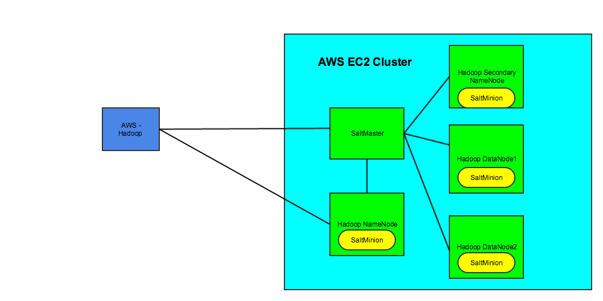
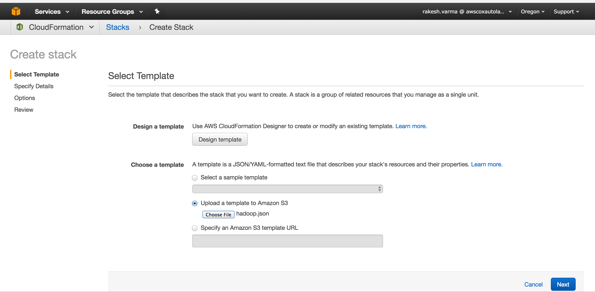

aws-hadoop
=======================
Python project that automates the creation of hadoop cluster.

 - AWS Cloudformation is used to create all the AWS resources.
 - Once AWS resources are created, config.ini needs to be updated to include the AWS EC2 dns names for hadoop nodes and salt.
 - Salt is used for configuration management. It is a used a distributed remote execution system to apply commands on hadoop nodes.
 - Python fabric is used to provide a friendly command line interface to run various tasks.


Usage
-----
Use this solution to create a hadoop cluster with any number of data nodes. This is the architectural diagram of the cluster.

Installation
------------

Create AWS Resources
-------------------------------
 Create a number of ubuntu machines (1 for saltmaster, 1 for hadoop name node, 1 for hadoop secondaryname node, and the remaining for hadoop data nodes) in AWS. Make sure you allow all the tcp ports (these are used for communication - 22, 50070, 50090, 8021, 8020)

To automate this step, follow these steps to use the cloud formation template.

 - Create a AWS keypair pem file that will allow you to ssh to AWS EC2
   instances.
 - open aws-hadoop/aws-cloudformation-template/hadoop.json,  Replace
   testkey with your AWS keypair. "KeyName": "testkey", The template has
   5 ubuntu nodes (1 for saltmaster, 1 for hadoopnamenode, 1 for
   secondarynamenode and 2 datanodes). Add more datanodes as required.
 - Once your template is ready, login to AWS management console, go to
   cloud formation, create stack and upload the template to create the
   hadoop cluster. Verify that all the ubuntu nodes are created.



Once all the AWS Resources are setup the next step is to provision hadoop cluster.
Provision Hadoop Cluster
----------------------------------


1. clone the git project
    ```
git clone https://github.com/varmarakesh/aws-hadoop
    ```
    
2. Install the python libraries (suggest using virtualenv for setting up python libraries)
    ```
        cd aws-hadoop
        virtualenv env
        source env/bin/activate
        pip install -r requirements.txt
    ```
    
3.  Edit the config.ini file to specify the ip's or public dns names of saltmaster, hadoop namenode, hadoop secondary namenode and hadoop datanodes. Assuming there is a key based login, also specify the key location.
4. Now in aws-hadoop/aws-hadoop, run

    ```
        fab hadoop.provision_hadoop_cluster
    ```

Compatibility
-------------
So far, this has been successfully tested on the following platforms.

mac osx 10.9
ubuntu server 16.04

Licence
-------

Authors
-------

`aws-hadoop` was written by `Rakesh Varma <varma.rakesh@gmail.com>`_.
